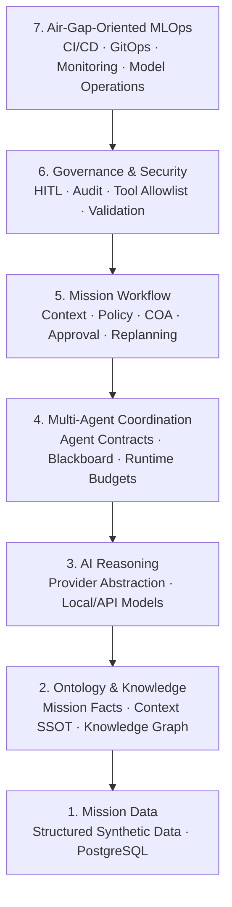

# MAIOS — Mission AI Reference Platform

<!-- MAIOS-LIVE-DEMO -->

## ▶ Live K10 Showcase Demo

**[Launch MAIOS K10 Live Demo](https://cptpark01.github.io/maios-showcase/index.html?v=160b13a)**

Experience the synthetic MAIOS mission decision-support workflow directly in your browser.

`Mission Context → COA → Verification → Human Decision → Controlled Simulation → Mission Event → Dynamic Replanning → Child HITL`

> Browser-only public showcase. No installation, Docker, database, model, API key, real military data, or external-system command capability is required.

---


> **A synthetic-data-based reference architecture that translates mission problems into controlled AI workflows, deterministic tools, measurable outcomes, and human-governed decisions.**

MAIOS는 국방·공공 분야의 복잡한 **Mission Problem**을 데이터, 정책, AI Agent, Tool, Workflow, Evaluation, Human-in-the-Loop 구조로 변환하기 위한 개인 연구·포트폴리오 프로젝트입니다.

> [!IMPORTANT]
> 이 Repository는 MAIOS의 **Public Portfolio Showcase**입니다. 전체 구현 Source Code와 세부 Engineering Artifact는 비공개 Repository에서 관리합니다.
>
> 모든 Mission 데이터, 부대 식별자, 자원 수치, 규칙, 사건 및 결과는 소프트웨어 아키텍처 검증을 위해 생성한 **Synthetic Data**입니다. 실제 군 운용자료, C4I 데이터, 실제 부대 배치, 무기운용 로직 또는 외부체계 명령 기능을 포함하지 않습니다.

---

## Why MAIOS?

```text
Mission Organization
"실제 Mission 문제는 이해하지만,
이를 구현 가능한 AI 요구사항으로 표현하기 어렵다."

                    ↕

          Mission–Technology
            Translation Gap

                    ↕

AI / Technology Organization
"모델과 플랫폼은 보유하지만,
어떤 Mission 문제를 어떤 기준으로 해결해야 하는지 명확하지 않다."
```

MAIOS는 이 간극을 다음 구조로 연결합니다.

```text
Mission Problem
      ↓
Operational Concept
      ↓
Structured Requirements
      ↓
Mission Data and Policy
      ↓
Controlled AI Workflow
      ↓
Deterministic Mission Tools
      ↓
Independent Verification
      ↓
Human Authorization
      ↓
Audit, Evaluation, and Monitoring
```

> **Mission Problem을 실행 가능하고 검증 가능한 AI System Workflow로 구조화하는 것**

---

## Core Design Principle

> **AI generates.**  
> **Tools calculate.**  
> **Rules constrain.**  
> **Verifier checks.**  
> **Humans authorize.**  
> **Actions remain controlled.**

```text
Generation        ≠ Calculation
Calculation       ≠ Evaluation
Verification      ≠ Authorization
Approval          ≠ Automatic Execution
Simulation        ≠ External-System Command
Previous Approval ≠ Current Operational Validity
```

---

## MAIOS 7-Layer Architecture



| Layer | Purpose |
|---|---|
| Mission Data | 구조화된 Synthetic Mission Data와 영속성 |
| Ontology & Knowledge | Mission Fact, Context SSOT, Entity Relationship |
| AI Reasoning | Provider 추상화와 근거 기반 설명 생성 |
| Multi-Agent Coordination | Agent Contract, Tool 권한, Runtime Budget |
| Mission Workflow | Policy, Multi-COA, Verification, HITL, Replanning |
| Governance & Security | Human Authority, Allowlist, Audit, Revision |
| Air-Gap-Oriented MLOps | 배포, 관측성, GitOps, 모델 운영 경로 |

> `Air-Gap-Oriented`는 폐쇄망 제약을 고려한 Reference Architecture라는 의미입니다. 실제 군 폐쇄망 운영 적합성이나 보안인증 완료를 주장하지 않습니다.

---

## Reference Mission — Synthetic K10 Resource Allocation

현재 Reference Mission은 **Synthetic K10 Resource Allocation Scenario**입니다.

가상의 지원자산과 지원대상 부대를 기반으로 다음을 검증합니다.

- 동일 Mission Context에서 복수 COA 생성
- 정책과 제약조건의 실행 가능한 Rule 평가
- COA 생성과 독립 검증 분리
- AI Recommendation과 Human Authorization 분리
- 승인 이후 Action의 별도 통제
- 상황 변경에 따른 기존 승인 유효성 재평가

```mermaid
flowchart LR
    A["Synthetic Mission Data"]
    B["Mission Context SSOT"]
    C["Executable Policy"]
    D["Multi-COA"]
    E["Independent Verifier"]
    F["Verifier-Gated HITL"]
    G["Human Decision"]
    H["Controlled Synthetic Action"]
    I["Mission Event"]
    J["Dynamic Replanning"]
    K["Evaluation · Audit · Monitoring"]

    A --> B
    B --> C
    C --> D
    D --> E
    E --> F
    F --> G
    G --> H
    H --> I
    I --> J
    J --> K
```



### COA Strategies

| Strategy | Primary Objective |
|---|---|
| Priority First | 우선순위가 높은 지원대상에 먼저 자원 배정 |
| Coverage First | 지원대상 간 수요 충족률 균형 |
| Resilience First | 고준비도 예비자원을 보존하고 위험 분산 |

```text
System Ranking ≠ Human Authorization
```

---

## Demonstrated Capabilities

| Capability | Demonstrated Evidence |
|---|---|
| Mission Context SSOT | Provenance-aware Mission Fact와 Versioned Context |
| Executable Mission Policy | Rule Set, Severity, Operator, Evidence Fact ID |
| Multi-COA Generation | Priority, Coverage, Resilience 후보 생성 |
| Independent Verification | 결정론적 Replay, 제약조건, Lineage 검증 |
| Verifier-Gated HITL | `VERIFIED` 상태에서만 Human Review 진입 |
| Human Decision Lifecycle | Approve, Reject, Request Revision |
| Controlled Synthetic Action | Allowlist, Risk Tier, 별도 Authorization |
| Dynamic Replanning | 새 Mission Fact, Execution Hold, 재승인 |
| Mission Orchestrator | 명시적 State Machine과 Artifact Lineage |
| Saga Recovery | Checkpoint Recovery, Retry, Dead Letter Queue |
| Contract-Governed Agents | Scope, Tool Permission, Runtime Budget |
| Runtime Evaluation | Legacy와 Multi-Agent Parity 비교 |
| Provider Evaluation | Schema, Evidence, Boundary, Repeatability |
| Blind Human Review | Provider Identity를 숨긴 품질 평가 |
| Golden Regression Gate | PASS, REVIEW, FAIL Release Gate |
| Operational Observability | Metrics, Trace, Alert, Mission Control |
| K10 End-to-End Demo | Timeline, Evidence Graph, HITL, Replanning |

---

## Governance and Safety Boundaries

### Independent Verification

Verifier는 다음을 독립적으로 확인합니다.

- Mission Context와 Policy Lineage
- Asset 및 Unit 존재 여부
- 자산 중복 배정
- Reserve와 Deployed Asset 분리
- Availability와 Readiness Threshold
- Allocation Limit
- Deterministic Strategy Replay
- Independent Metric Recalculation
- Evidence Coverage와 Unsupported Reference

```text
Document Retrieval ≠ Executable Rule Evaluation
Verification       ≠ Authorization
```

모든 K10 Rule은 Software Architecture 검증을 위한 Synthetic Training Rule이며 실제 군 교리, ROE 또는 SOP가 아닙니다.

### Controlled Action

| Risk Tier | Description | Showcase Policy |
|---:|---|---|
| 0 | Read-only | Allowed |
| 1 | Draft or structured export | Verified approval required |
| 2 | Internal simulation-state update | Separate authorization required |
| 3 | External-system action | Blocked |

현재 허용 범위는 보고서 Draft, 승인된 COA의 구조화 Export, 내부 Synthetic Simulation으로 제한됩니다.

### Dynamic Replanning

```text
Approved COA
      ↓
Synthetic Mission Event
      ↓
New Mission Fact and Context
      ↓
Impact Analysis
      ├── No Replan → Existing COA Remains Valid
      └── Replan Required
                ↓
           Execution Hold
                ↓
           Policy Re-evaluation
                ↓
           Multi-COA Regeneration
                ↓
           Independent Verification
                ↓
           Human Reapproval
```

기존 Human Decision은 Audit History에 남고 새로운 상황은 새로운 Revision을 생성합니다.

---

## Contract-Governed Multi-Agent Runtime

MAIOS의 Agent는 제한 없는 Autonomous Process가 아닙니다.

- Readable / Writable Blackboard Scope
- Allowed Tools
- Maximum Tool Calls
- Runtime Timeout
- Recommendation / Approval / Execution Authority

```text
may_recommend = true
may_authorize = false
may_execute = false
```

| Agent | Responsibility |
|---|---|
| Context Agent | Mission Context 요약 |
| Planner Agent | Multi-COA 생성 |
| Constraint Agent | 제약조건 검토 |
| Risk Agent | 결정론적 위험 평가 |
| Verifier Agent | 독립 검증 |
| Commander Support Agent | Evidence 기반 Recommendation |

### Safe Runtime Migration

```text
legacy_only
= Legacy Planning and Verification

shadow_compare
= Legacy remains authoritative
+ Multi-Agent Runtime executes for evaluation

multi_agent
= Contract-Governed Runtime becomes authoritative
```

```text
Legacy Baseline
      ↓
Shadow Comparison
      ↓
Parity Evaluation
      ↓
Human Review
      ↓
Controlled Activation
```

---

## Evaluation and Regression Gate

### Evaluation Scope

- Runtime Parity와 Candidate COA Overlap
- Selected COA Agreement
- Verification 및 HITL Readiness Parity
- Context와 Policy Lineage
- Tool Permission 및 Execution Authority Boundary
- JSON Schema와 Evidence Reference Validity
- Recommendation Repeatability
- P50 / P95 Latency와 Token Usage

Structural Score는 Semantic Truth, Military Validity 또는 Operational Suitability를 입증하지 않습니다.

### Blind Human Review

| Dimension | Scale |
|---|---:|
| Clarity | 1–5 |
| Evidence Alignment | 1–5 |
| Uncertainty Calibration | 1–5 |
| Decision-Support Utility | 1–5 |
| Overclaim Control | 1–5 |

### Golden Regression Gate

```text
PASS
= Required thresholds and safety gates satisfied

REVIEW
= No critical safety violation,
  but quality or performance review required

FAIL
= Runtime, Schema, Evidence,
  or Authority Boundary violation
```

---

## Verification Snapshot

다음은 특정 Local Release Candidate Audit 시점의 결과입니다.

| Check | Result |
|---|---:|
| Automated tests | **159 passed** |
| OpenAPI paths | **105** |
| Python compile | **PASS** |
| Application import | **PASS** |
| Test collection | **PASS** |
| Docker Compose validation | **PASS** |
| API contract validation | **PASS** |
| Environment file tracking | **PASS** |
| Manual secret review | **PASS** |

> 이 결과는 해당 Audit 시점의 Snapshot입니다. 구현 변경 이후에는 동일한 검증을 다시 수행해야 합니다. 원본 Audit Log, Secret Scan Log, Credential 및 로컬 Runtime Artifact는 공개하지 않습니다.

---

## Operational Observability

```text
Mission Workflow
      ↓
Metrics · Trace · Audit Event
      ↓
Prometheus · OpenTelemetry
      ↓
Grafana · Tempo · Alertmanager
      ↓
Mission Control
```

관측 대상에는 Workflow Transition, Mission Operation Latency, Provider Failure, Pending Approval, Blocked Release, Execution Hold, Replanning, Recovery Retry, Dead Letter 및 Error Budget Burn이 포함됩니다.

Alert는 COA 승인, Execution Hold 해제 또는 외부 Action을 자동 수행하지 않습니다.

---

## Technology Stack

| Area | Technology |
|---|---|
| Language / API | Python / FastAPI |
| Validation / ORM | Pydantic / SQLAlchemy |
| Data | PostgreSQL / Neo4j |
| Local Model Serving | Ollama |
| Models | Llama 3.2 / EXAONE 3.5 / Upstage Solar |
| Agent Architecture | Contract-Governed Multi-Agent |
| Mission Logic | Deterministic Algorithms |
| Governance | HITL + Audit + Revision |
| Evaluation | Runtime / Provider / Human Review |
| Monitoring / Tracing | Prometheus / OpenTelemetry / Tempo |
| Dashboard | Grafana / Streamlit |
| Deployment | Docker / Kubernetes / Argo CD |
| CI/CD / Registry | GitHub Actions / GHCR |
| Testing | pytest |

---

## My Role

MAIOS는 개인 Mission AI System Engineering 포트폴리오로 설계·구현했습니다.

### Mission and Domain

- Mission Problem Definition
- Operational Concept Structuring
- Mission Requirement Translation
- Synthetic K10 Reference Scenario
- Governance and Authority Boundary Design

### AI System Engineering

- Mission Context SSOT와 Executable Policy
- Provider Abstraction과 Controlled Tool Calling
- Multi-Agent Contract
- Evaluation과 Regression Gate

### Backend and Platform

- FastAPI, PostgreSQL, Neo4j
- Docker와 Kubernetes Deployment Path
- Prometheus, Grafana, OpenTelemetry
- CI/CD와 Release Candidate Validation

### Demonstration

- K10 End-to-End Demo Story
- Mission Timeline과 Evidence Graph
- HITL Decision Flow
- Dynamic Replanning Scenario
- Architecture Briefing Material

---

## Public Showcase Scope

```text
Public maios-showcase
= Executive Story
+ Architecture
+ Demo Flow
+ Verification Evidence
+ Personal Contribution
+ Limitations

Private MAIOS
= Full Implementation
+ Tests
+ Engineering Artifacts
+ Detailed Configuration
```

공개하지 않는 항목:

- 전체 Source Code
- 내부 Rule과 Prompt
- 상세 API Payload
- Credential과 환경설정
- Raw Benchmark Result
- Audit 및 Secret Scan Log
- Security Configuration

---

## Scope and Limitations

MAIOS는 개인 포트폴리오 및 연구용 **Mission AI Reference Architecture and Decision-Support Prototype**입니다.

### Not Included

- Classified Information
- Actual Military Operational Data
- Real C4I Data
- Real Unit Deployment Data
- Real Weapon Employment Logic
- Autonomous Weapon Control
- External-System Command Execution
- Military Network Accreditation
- Operational Certification
- Production HA/DR Certification

### Security Limitations

- Audit Trail은 Application-level Append-only 구조입니다.
- Cryptographic Immutability를 주장하지 않습니다.
- 실제 Zero Trust 통합 완료를 주장하지 않습니다.
- 실제 폐쇄망 보안인증 완료를 주장하지 않습니다.
- 실제 작전 적합성 또는 군사적 유효성을 주장하지 않습니다.

---

## Roadmap

### Portfolio Improvements

- Architecture Diagram 고도화
- K10 Demo Screenshot와 Walkthrough
- Degraded Mode Demonstration
- Public Validation Summary
- Executive Brief와 Interview Demo Package

### Technical Extensions

- Advanced Mission Ontology와 GraphRAG
- Multiple Mission Tools
- Expanded Agent Contracts
- RBAC와 Zero Trust Integration
- Offline Model Registry
- SBOM과 Artifact Signing
- Cryptographic Audit Integrity

Roadmap 항목은 구현 완료를 의미하지 않습니다.

---

## Key Takeaway

```text
Foundation Model    → Replaceable
Mission Workflow    → Persistent
Mission Tools       → Controlled
Mission Calculation → Deterministic
Evaluation          → Independent
Final Authority     → Human
```

> **Translate Mission Problems into controlled, measurable, and human-governed AI workflows.**

---

## Author

**Park** — [GitHub @cptpark01](https://github.com/cptpark01)

- Mission / Defense Domain Experience
- M.S. in Electrical Engineering
- AI System Engineering
- Mission AI Platform
- AI DevOps / MLOps
- Defense AX

---

> **Mission problems should not be handed directly to an LLM. They should be structured into controlled, testable, measurable, and human-governed AI workflows.**

<!-- MAIOS-SHOWCASE-SCOPE -->

## What the Live Demo Shows

The K10 Live Demo is a **browser-based synthetic showcase replay**
of the MAIOS mission decision-support workflow.

```text
Mission Context
→ Multi-COA
→ Independent Verification
→ Human Decision
→ Controlled Simulation
→ Mission Event
→ Dynamic Replanning
→ Child HITL
→ Human Reapproval
```

### Public Showcase Boundary

The public demo intentionally does **not** include:

- Private MAIOS backend source code
- Real military or C4I data
- Production credentials
- Detailed internal ontology, rules, or prompts
- Autonomous weapon control
- External-system command capability

The private implementation, tests, and engineering records
are maintained separately from this public showcase.
