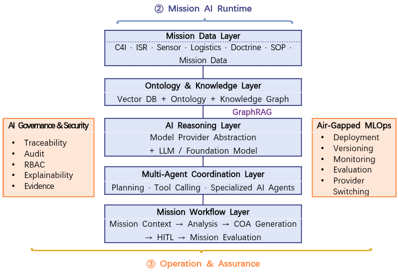
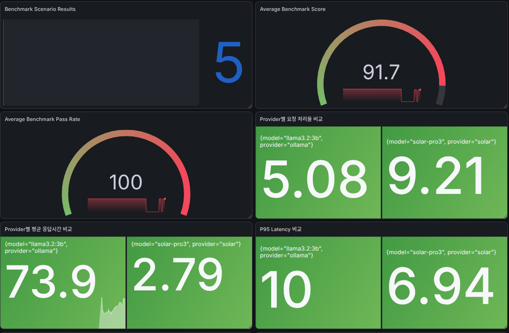
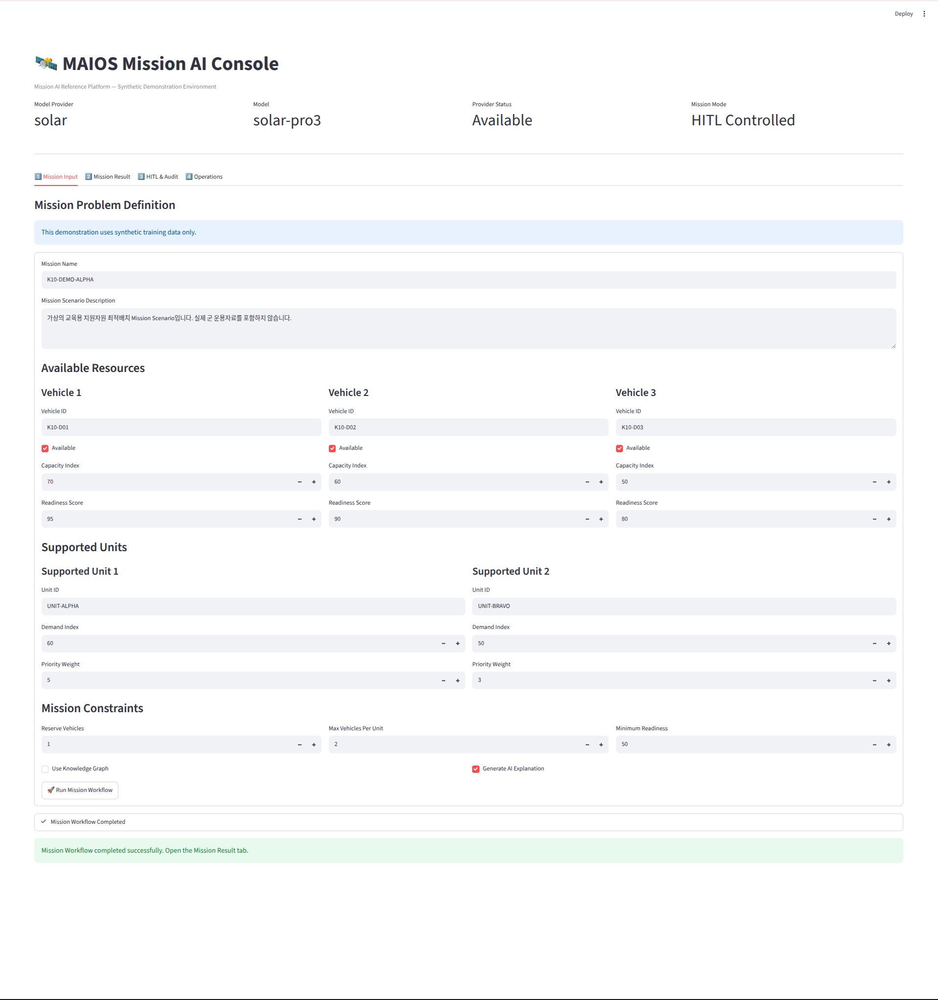
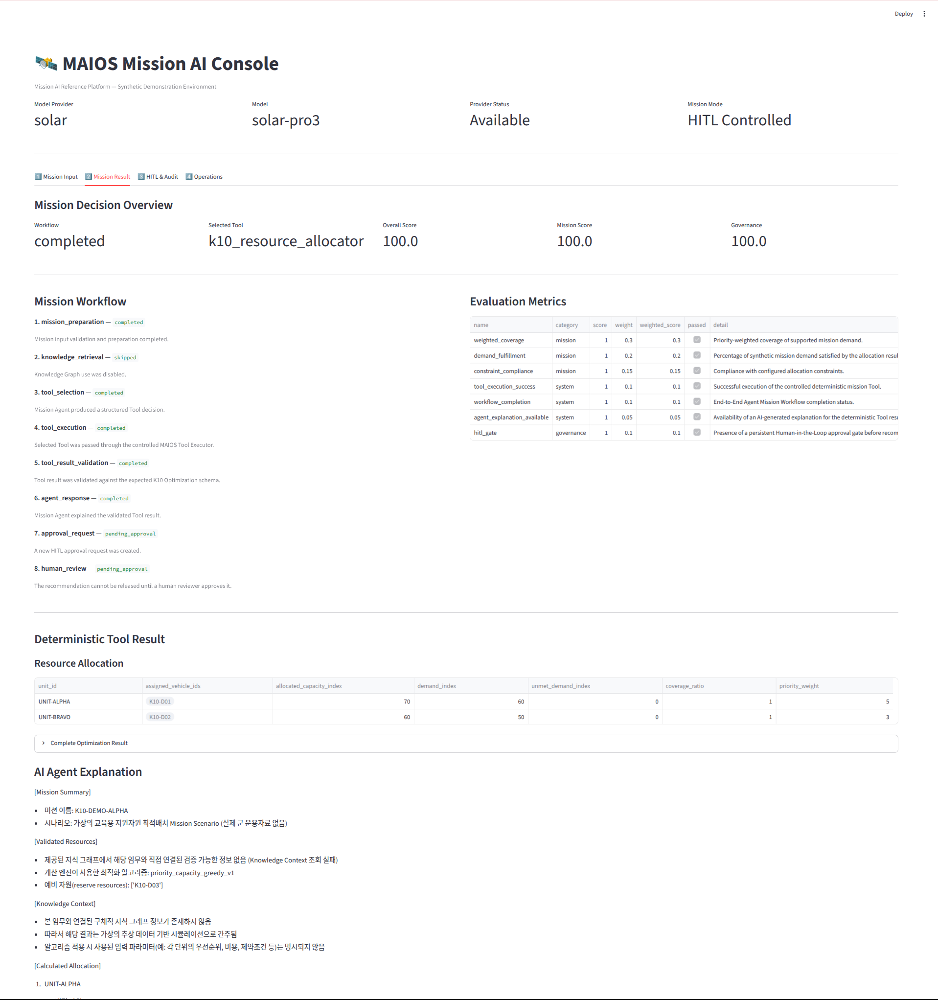
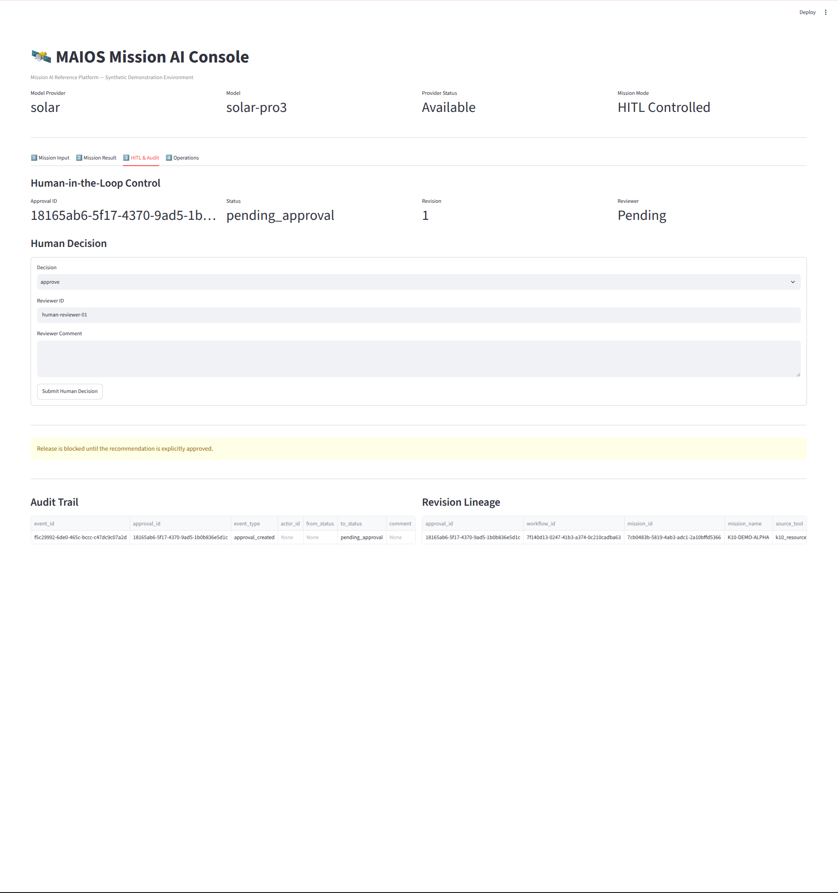
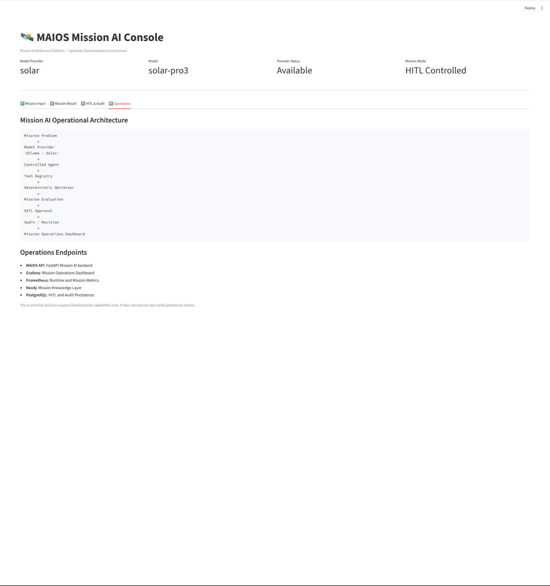

# MAIOS — Mission AI Operating System

> **A Mission-Centric AI Platform for Defense AI Transformation**
> Bridging military operational requirements and AI technology implementation.

<p align="center">
  <b>Defense Domain Expertise × Mission Architecture × AI Agents × Human-in-the-Loop × AI Platform Engineering</b>
</p>

---

## 1. Overview

**MAIOS (Mission AI Operating System)** is a mission-centric AI platform portfolio project designed to explore how real-world military mission requirements can be translated into an integrated AI system.

The project started from a practical problem observed in Defense AI transformation:

> **AI companies have advanced technologies, while military organizations have complex mission requirements — but translating operational needs into implementable AI systems remains a major challenge.**

Based on approximately 30 years of military experience across operations, force development, defense planning, weapon-system-related projects, and international cooperation, I designed MAIOS as a reference architecture and working Proof of Concept (PoC) that connects:

```text
Mission Problem
      ↓
Operational Concept
      ↓
Mission Requirements
      ↓
Data Strategy & Governance
      ↓
Mission Data
      ↓
AI Models & Knowledge
      ↓
AI Agents & Tools
      ↓
Mission Workflow
      ↓
Human-in-the-Loop
      ↓
Mission Evaluation
```

MAIOS is not intended to replace existing command-and-control systems.

Its purpose is to demonstrate how **mission problems, data, AI models, agents, tools, human judgment, and operational workflows** can be connected through a common AI platform architecture.

---


# 2. Why MAIOS?

Defense AI projects often begin with available technologies:

* Large Language Models
* Computer Vision
* Retrieval-Augmented Generation
* AI Agents
* Knowledge Graphs
* MLOps Platforms

However, successful Defense AI transformation should begin with the mission.

```text
Technology-Driven Approach

AI Model
   ↓
Find a Use Case
   ↓
Attempt Integration
```

MAIOS takes the opposite approach.

```text
Mission-Driven Approach

Mission Problem
   ↓
Operational Concept
   ↓
Mission Requirement
   ↓
Required Data
   ↓
AI Capability
   ↓
Agent / Tool / Workflow
   ↓
Human Decision Support
```

The central design principle of MAIOS is:

> **AI technology should be selected and orchestrated based on mission requirements, rather than forcing missions to adapt to a specific AI model.**

---

# 3. MAIOS Architecture

MAIOS is organized into seven conceptual layers.

```text
┌──────────────────────────────────────────────────────────┐
│  7. Air-Gapped MLOps Layer                               │
│     Deployment · Monitoring · Evaluation · Operations    │
├──────────────────────────────────────────────────────────┤
│  6. AI Governance & Security Layer                       │
│     HITL · Audit · Access Control · AI Governance        │
├──────────────────────────────────────────────────────────┤
│  5. Mission Workflow Layer                               │
│     Mission Workflow · OODA · Human-AI Collaboration     │
├──────────────────────────────────────────────────────────┤
│  4. Multi-Agent Coordination Layer                       │
│     Agents · Tool Calling · Task Coordination            │
├──────────────────────────────────────────────────────────┤
│  3. AI Reasoning Layer                                   │
│     LLM · RAG · Reasoning · Model Provider               │
├──────────────────────────────────────────────────────────┤
│  2. Ontology & Knowledge Layer                           │
│     Mission Knowledge · Relationships · Context          │
├──────────────────────────────────────────────────────────┤
│  1. Mission Data Layer                                   │
│     Structured · Unstructured · Operational Data         │
└──────────────────────────────────────────────────────────┘
```

> The architecture is designed to separate mission applications from individual AI models and infrastructure technologies.

<!-- Replace the path below with the actual public architecture image -->



---

# 4. Core Design Principles

## Mission First

AI implementation begins with a clearly defined mission problem rather than a specific model or technology.

## Model Independence

Mission workflows should not be tightly coupled to a single foundation model.

MAIOS therefore introduces a **Model Provider Abstraction Layer** so different AI models can be connected without redesigning the entire mission application.

## Tool-Augmented AI

AI agents should not rely only on language generation.

They should be able to interact with deterministic mission tools, data sources, and analytical functions.

## Human-in-the-Loop

AI recommendations in mission-critical environments should remain reviewable and controllable by human decision-makers.

## Evaluation by Mission Value

AI performance should ultimately be evaluated not only by model metrics, but also by how effectively it supports mission outcomes.

## Deployability in Restricted Environments

Defense AI platforms must consider environments with limited or disconnected external network access.

MAIOS therefore includes the concept of **Air-Gapped AI Operations and MLOps** as part of the architecture.

---

# 5. Implemented Capabilities

The MAIOS PoC was implemented incrementally around several core capabilities.

## 5.1 Model Provider Abstraction

A provider-independent model interface separates mission workflow logic from individual AI models.

```text
Mission Application
        ↓
Model Provider Interface
        ↓
┌─────────────┬─────────────┬─────────────┐
│ Local Model │ External AI │ Future Model│
└─────────────┴─────────────┴─────────────┘
```

This architecture allows different foundation models to be evaluated or integrated while preserving the mission application layer.

For enterprise and defense deployments, this design can support future integration with sovereign or organization-specific foundation models.

---

## 5.2 End-to-End Mission Workflow

MAIOS includes an end-to-end mission workflow based on a synthetic defense logistics scenario.

The workflow demonstrates the transition from:

```text
Mission Request
      ↓
Input Validation
      ↓
Mission Context Analysis
      ↓
AI Reasoning
      ↓
Mission Tool Execution
      ↓
Candidate Recommendation
      ↓
Human Review / Approval
      ↓
Mission Result
      ↓
Evaluation & Audit
```

The scenario is designed only as a technical PoC and uses **synthetic, non-sensitive data**.

<!-- Replace with actual workflow image -->


---

## 5.3 Tool Calling

MAIOS connects AI reasoning with structured mission tools.

This enables the AI layer to use deterministic functions instead of attempting to solve every problem through text generation alone.

Conceptually:

```text
User / Mission Request
        ↓
AI Agent
        ↓
Tool Selection
        ↓
Structured Tool Input
        ↓
Mission Analysis Function
        ↓
Tool Result
        ↓
AI-Assisted Recommendation
```

This architecture is intended to improve:

* Reliability
* Explainability
* Repeatability
* Integration with existing systems

---

## 5.4 Human-in-the-Loop (HITL)

MAIOS introduces explicit human review points in the mission workflow.

```text
AI Analysis
     ↓
AI Recommendation
     ↓
Human Review
  ↙       ↓       ↘
Approve  Revise   Reject
     ↓
Mission Workflow Continues
```

The objective is not full autonomous decision-making.

The objective is:

> **AI-assisted decision support with human authority and accountability.**

---

## 5.5 Mission Evaluation

MAIOS includes an evaluation concept designed to assess AI outputs in the context of a mission workflow.

The evaluation layer is intended to support questions such as:

* Was the mission workflow successfully completed?
* Did the AI use the appropriate tools?
* Was human intervention required?
* Was the recommendation consistent with mission constraints?
* Can the decision process be reviewed afterward?

This approach extends evaluation beyond conventional LLM response quality toward **mission-oriented AI evaluation**.

---

## 5.6 Observability

The platform includes observability concepts and components for monitoring AI services and mission APIs.

Implemented technologies include:

* Prometheus
* Grafana
* Application metrics
* API health monitoring

<!-- Replace with actual screenshot -->



---

# 6. Demonstration Scenario

## K10 Ammunition Resupply Decision-Support Workflow

The MAIOS demonstration uses a simplified and synthetic K10 ammunition resupply scenario to show how an operational problem can be converted into an AI-assisted mission workflow.

The objective of the demonstration is **not to reproduce an actual military operational system**.

Instead, the scenario demonstrates the system-engineering process:

```text
Operational Problem
        ↓
Mission Requirements
        ↓
Structured Mission Data
        ↓
AI Reasoning
        ↓
Mission Tool Calling
        ↓
Candidate Course of Action
        ↓
Human Review
        ↓
Evaluation
```

The scenario was selected because logistics and resource-allocation problems provide a clear way to demonstrate the relationship between:

* Domain requirements
* Data
* AI reasoning
* Optimization tools
* Human judgment

All publicly presented data and scenarios are synthetic and non-sensitive.

---

# 7. Technology Stack

| Area               | Technology                          |
| ------------------ | ----------------------------------- |
| Backend            | Python, FastAPI                     |
| API                | REST API                            |
| Data               | PostgreSQL                          |
| Knowledge          | Knowledge / Ontology Architecture   |
| AI Integration     | Model Provider Abstraction          |
| AI Workflow        | Agent-based Workflow                |
| AI Capability      | LLM, Tool Calling                   |
| Governance         | Human-in-the-Loop                   |
| Evaluation         | Mission-oriented Evaluation         |
| Containerization   | Docker                              |
| Monitoring         | Prometheus, Grafana                 |
| Deployment Concept | On-Premise / Air-Gapped Environment |

The project focuses less on a single technology and more on **how multiple technologies can be integrated around a mission workflow**.

---

# 8. From Mission Requirement to AI System

One of the primary objectives of MAIOS is to demonstrate the translation process between military domain requirements and AI system requirements.

| Mission Perspective   | AI / System Perspective |
| --------------------- | ----------------------- |
| Mission Problem       | AI Use Case             |
| Operational Concept   | System Workflow         |
| Mission Requirement   | Functional Requirement  |
| Operational Data      | AI Data Requirement     |
| Commander / Operator  | Human-in-the-Loop       |
| Staff Function        | AI Agent / Tool         |
| Decision Process      | Mission Workflow        |
| Mission Effectiveness | Mission Evaluation      |
| Security Constraint   | Deployment Architecture |

This translation layer is where I believe **Defense Domain Expertise and AI System Engineering must meet**.

---

# 9. My Contribution

This portfolio project was independently planned and developed as part of my transition into Defense AI and AI platform roles.

My contribution includes:

* Identification of Defense AI implementation challenges
* Mission problem definition
* Operational concept development
* Mission requirement structuring
* MAIOS platform architecture design
* Mission workflow design
* Model Provider architecture
* Tool Calling workflow
* Human-in-the-Loop design
* Mission Evaluation design
* FastAPI-based service implementation
* Container-based environment configuration
* Monitoring and observability integration
* PoC testing and iterative improvement
* Documentation and architecture communication

AI-assisted development tools were actively used during implementation.

However, the project's:

* Problem definition
* Architecture direction
* Functional priorities
* Mission scenario
* System integration decisions
* Validation process

were defined and managed by the author.

---

# 10. What I Learned

Building MAIOS reinforced several lessons.

### 1. Defense AI is not only a model problem.

Successful AI adoption requires the integration of mission requirements, data, workflows, security, governance, and operations.

### 2. Domain experts and AI engineers need a common architecture.

Military users often describe operational problems, while AI teams think in terms of models, data, APIs, and infrastructure.

A successful Defense AI organization needs people who can translate between both domains.

### 3. AI Agents require tools and governance.

In mission-critical environments, autonomous text generation is not enough.

AI systems require structured tools, validation, human oversight, evaluation, and auditability.

### 4. The AI model should be replaceable.

Mission applications should survive changes in foundation models.

This is why MAIOS separates mission workflows from individual model providers.

---

# 11. Relevance to Enterprise Defense AI

MAIOS represents my approach to Defense AI business and system development:

```text
Understand the Mission
        ↓
Identify the Real Problem
        ↓
Translate Requirements
        ↓
Define Required Data
        ↓
Design the AI Architecture
        ↓
Build a PoC
        ↓
Evaluate Mission Value
        ↓
Develop toward Deployment
```

My long-term objective is to work at the intersection of:

> **Defense Mission Expertise × AI Technology × System Architecture × Business Development**

and contribute to transforming real operational requirements into deployable AI capabilities.

---

# 12. Public Repository Scope

This repository is a **public portfolio showcase**.

For security and intellectual-property considerations, the following are intentionally not included:

* Full source code
* Detailed agent orchestration logic
* Internal prompts
* Detailed mission logic
* Detailed evaluation logic
* Security configuration
* Deployment credentials
* Sensitive or operational military data

The complete implementation is maintained separately in a private development repository.

This public showcase contains only generalized architecture, technical concepts, synthetic demonstration scenarios, and selected implementation results.

---

# 13. Project Status

```text
[Completed] Mission AI Architecture
[Completed] Model Provider Abstraction
[Completed] End-to-End Mission Workflow
[Completed] Tool Calling
[Completed] Human-in-the-Loop
[Completed] Mission Evaluation
[Completed] Monitoring / Observability
[Ongoing]  Foundation Model Evaluation and Integration
[Ongoing]  Architecture Refinement for Enterprise Defense AI
```

---






# 14. About the Author

Military domain professional transitioning into Defense AI and AI platform development.

Background includes:

* Approximately 30 years of military experience
* Military operations and planning
* Force development and defense projects
* Weapon-system-related research and planning experience
* International military cooperation
* Defense AI and AI platform architecture
* M.S. in Electrical Engineering

My focus is not only on developing AI technology itself, but on answering a broader question:

> **How can AI technology be transformed into a system that solves real mission problems?**

---

## Disclaimer

MAIOS is an independent portfolio and technical research project.

It is not an official military system or government project.

All publicly presented scenarios and data are synthetic, generalized, or based on non-sensitive conceptual examples.

No classified, restricted, or operationally sensitive information is included in this repository.

---

<p align="center">
  <b>MAIOS — From Mission Problems to Mission AI Systems</b>
</p>
